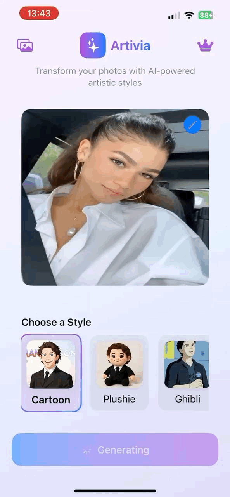
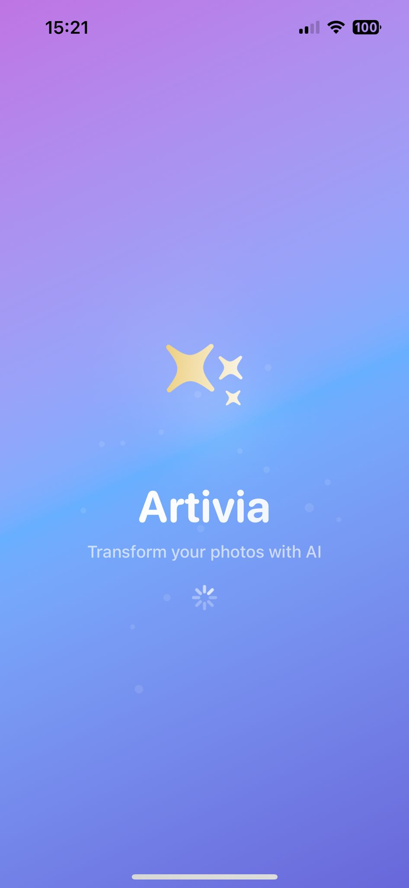
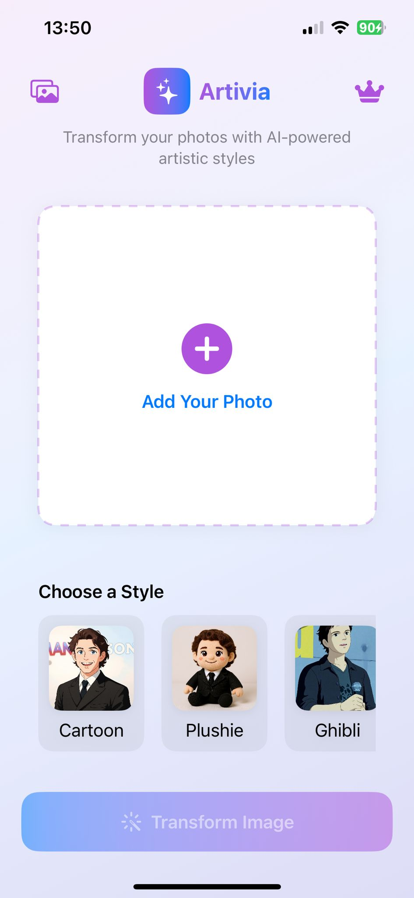
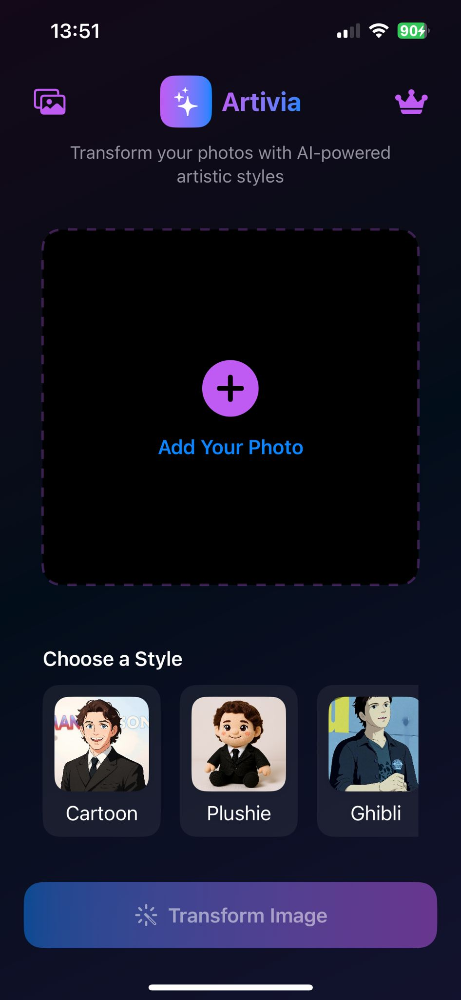
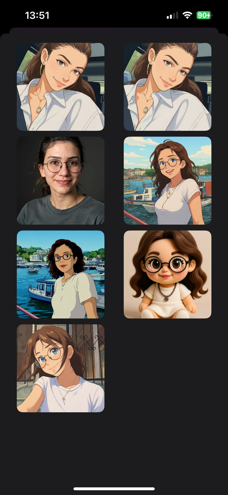

# 🎨 Artivia
AI destekli fotoğraf dönüştürme uygulaması. Tek dokunuşla fotoğraflarınızı farklı stillerde yeniden yaratın.  
SwiftUI ile geliştirildi, Fal.ai ve Firebase teknolojileri kullanıldı.

---

## 🚀 Demo

*Artivia'nın fotoğraf dönüştürme sürecini gösteren kısa bir demo.*

---

## 🖥 Splash Ekranı

*Uygulamanın açılış ekranı animasyonu.*

---

## ✨ Özellikler
- 📷 **Fotoğraf Seçme:** Galeriden veya kameradan fotoğraf ekleme
- 🎭 **Stil Seçimi:** Birden fazla AI destekli görsel stil
- ⚡ **Hızlı İşleme:** Fal.ai API ile hızlı dönüşüm
- 📂 **Galeri:** Önceki dönüşümleri kaydetme ve görüntüleme
- ☁️ **Bulut Depolama:** Firebase Storage entegrasyonu
- 🗑 **Silme & Kaydetme:** Dönüştürülmüş görselleri yönetme

---

## 🖼 Ekran Görüntüleri
| Home View | Home View | Gallery View | Result View |
|-----------|-----------|--------------|-------------|
|  |  |  |  |

---

## 🧰 Teknolojiler
- **SwiftUI** – Modern ve deklaratif UI geliştirme
- **Fal.ai API** – Yapay zeka destekli görsel işleme
- **Firebase Storage** – Bulut tabanlı dosya depolama ve yönetim
- **MVVM** – Model-View-ViewModel mimarisi ile modüler yapı
- **Swift Package Manager** – Bağımlılık yönetimi
